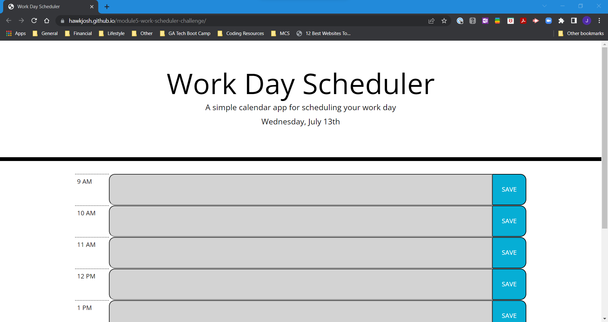

# module5-work-scheduler-challenge

## Description

In this challenge, I updated the provided source code to meet all acceptance criteria so the schedule application functions correctly given user input/interaction with the page and current date/time information.

## Screenshot

## Link

To view the deployed website, [CLICK HERE](https://hawkjosh.github.io/module5-work-scheduler-challenge/).